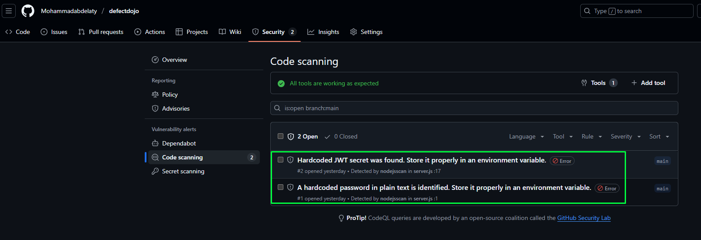

# Security report

This repo is a very simple project about detecting vulnerabilities in code using devops pipeline. 
We will use defectdojo an open-source report security report viewer and cyclon for dependancies tracking.

In your environment you may use gitlab as on-prem Git, in this case you will need to deploy defectdojo and dependency tracker to view your results.
But in case of github, it has its' integrated vulnrability report viewer as it'll br covered in this repo.  

# SAST

## defectdojo
As docker is better than install in OS, we will go with it.

* While inititing the dokcer compose you'd better check latest log of initializer to get randomly generated admin password each time you run the containers.

```bash
cd defectdojo && docker compose up
```

## Note inside the defectdojo:
In defectdojo we use `Product` instead of `Project` as eveolving process is almost permenant. so we create a product.
Create an engagement for specifi period and link it to your product.
Import scan result: id does `Done` and `Add Test` buttons functions and let you add import your scan.

To test this sast report i used the current project in  gitlab and enabled the SAST. It exported me a json file as a result that i used in defecdojo as follows.


in ci file
```yaml
include:
  - template: Security/SAST.gitlab-ci.yml
```
I also added ci configurations to generate the `sbom.json` it'll be used later.
```yaml
generate-sbom:
  screens/image: node:20
  stage: build
  before_script:
    - npm i @cyclonedx/cyclonedx-npm
    - npm install  # Ensure all deps are in place
  script:
    - npx @cyclonedx/cyclonedx-npm --output-file sbom2.json
  artifacts:
    paths:
      - sbom2.json
    expire_in: 1 week
```
Now commit the cahnges


and it's done

Now donwload the artifacts


Back to creating an engagement in defectdojo
we specify the `scan type: Gitlab SAS Report`

Now right after importing the gitlab sast file in to the engagement it get the findings


* It detects that I'm using a hardcoded credentials.. WHAT 😢 !!!!
```js
const token = jwt.sign({ userId: 123 }, 'mysecretkey'); // Hardcoded secret
```
* It wasn't me.

## Github

To test the sast as a report in github workflow as shown in .github/workflow/njsscan.yml

After `git push` as it's your trigger you can see your workflow running. check it in `Actions` tab
After all done check `Security` tab.


* Still denying 🤭


# SBOM
Stands for Software Ber Of Material

Start dtrack

```bash
cd dtrack && docker compose up
```
use 
Username: admin
Password: admin
for the frist login then change it as required.

As shown before in the screen of artifacts in gitlab "semgrep"
Carete a project in dtrack > component > Upload Bom. then upload the sbom2.json file, after uploading is successful reload the page and check the compnents again.

You will see almost 301 compnent and in vulnerability tab you see what you are looking for.


